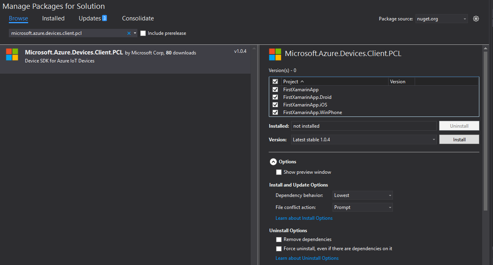

Create a simple a simple Csharp application targeting Android/iOS/UWP under Windows
===
---

# Table of Contents

-   [Introduction](#Introduction)
-   [Step 1: Prerequisites](#Prerequisites)
-   [Step 2: Create a new application](#CreateApplication)
-   [Step 3: Send data to IotHub](#SendData)
-   [Step 4: Receive data from IotHub](#ReceiveData)

<a name="Introduction"></a>
# Introduction

**About this document**

This document describes how to build and run a simple application targeting Android/iOS/Windows Phone using the IoT SDK PCL library on the Windows platform.

<a name="Prerequisites"></a>
# Step 1: Prerequisites

You should have the following items ready before beginning the process:

-   Windows Desktop
-   Visual Studio 2015 with NuGet package manager
-	Xamarin for Windows (https://msdn.microsoft.com/en-us/library/mt613162.aspx)
-   [Setup your IoT hub][lnk-setup-iot-hub]
-   [Provision your device and get its credentials][lnk-manage-iot-hub]

<a name="CreateApplication"></a>
# Step 2: Create a new application

-   Create a solution using the following guide: https://msdn.microsoft.com/en-us/library/mt488769.aspx
-	Right click on the solution in Solution Explorer
-	Click on "Manage NuGet Packages for solution"
-	Install the "Microsoft.Azure.Devices.Client.PCL" nuget in all the projects of the solution
	
-	You're ready to send/receive data to/from Microsoft Azure IotHub!

<a name="SendData"></a>
# Step 3: Send data to IotHub

-   The following code can be copy/pasted anywhere an action is to be performed, in order to send data to IotHub (for instance, in a method triggered by a button click/touch)

    ``` csharp
            // Connect to Azure IoT Hub
            string DeviceConnectionString = "<replace>"; //replace `<replace>` with the connection string for your device.
            DeviceClient deviceClient = DeviceClient.CreateFromConnectionString(DeviceConnectionString, TransportType.Http1);
            
            // Create a message
            string dataBuffer = string.Format("Message from PCL: {0}", Guid.NewGuid().ToString());
            var eventMessage = new Message(Encoding.UTF8.GetBytes(dataBuffer));
            
            // Send the message
            deviceClient.SendEventAsync(eventMessage);
	```
    		
-   See [Manage IoT Hub][lnk-manage-iot-hub] to learn how to observe the messages IoT Hub receives from the application and how to send cloud-to-device messages to the application.

<a name="ReceiveData"></a>
# Step 4: Receive data from IotHub

-   The following code can be copy/pasted anywhere an action is to be performed, in order to receive data from IotHub (for instance, in a background thread waking every once
in a while to check for new messages):

    ``` csharp
            Message receivedMessage = null;
            try
            {
                receivedMessage = await deviceClient.ReceiveAsync();

                if (receivedMessage != null)
                {
                    byte[] data = receivedMessage.GetBytes();
                    Debug.WriteLine(Encoding.UTF8.GetString(data, 0, data.Length) + "\r\n");
                    Debug.WriteLine("Message received, now completing it...");
                    await deviceClient.CompleteAsync(receivedMessage);
                    Debug.WriteLine("Message completed.");
                }
            }
            catch (Exception ex)
            {
                Debug.WriteLine("Error while receiving a message from IoT Hub: " + ex.Message);
                if (receivedMessage != null)
                    await deviceClient.RejectAsync(receivedMessage);
            }
    ```

[lnk-setup-iot-hub]: ../setup_iothub.md
[lnk-manage-iot-hub]: ../manage_iot_hub.md